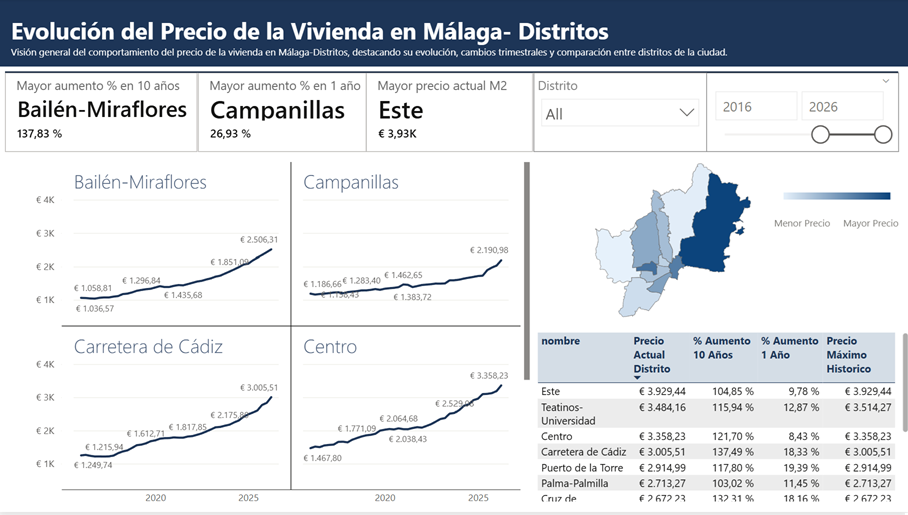
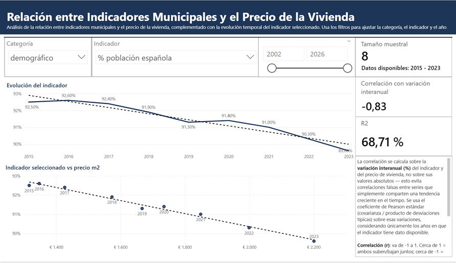

# Diseño e Implementación de un Data Warehouse para el Análisis del Mercado Inmobiliario en España

Trabajo Final de Máster — Arquitectura de datos end-to-end para la ingesta, almacenamiento, transformación y visualización de datos abiertos del mercado inmobiliario español.

**Dashboard interactivo**: https://paoeiri.github.io/datalakeUpload/docs/index.html

---


## Resumen

Pipeline de datos end-to-end (ingesta → data warehouse → visualización) que analiza el mercado inmobiliario de Málaga a partir de datos abiertos de Tinsa, el Ministerio de Transportes y el INE. Desde 2001 hasta 2026, el precio por m² en el municipio de Málaga ha pasado de **€696 a €2.931** (+14,7% solo en el último año), con diferencias de hasta el **137,83%** en 10 años entre distritos.

**🔗 Dashboard interactivo**: https://paoeiri.github.io/datalakeUpload/docs/index.html

### Vistas del dashboard

**Evolución del precio de la vivienda en Málaga vs Andalucía vs España**
Precio por m², transacciones por tipo de vivienda (libre, segunda mano, nueva, protegida) y variación interanual, con serie histórica trimestral desde 2001.


**Comparativa por distritos**
Mapa de calor y ranking de los 11 distritos de Málaga por precio actual, variación a 1 y 10 años. Bailén-Miraflores lidera el crecimiento a 10 años (+137,83%), Campanillas el crecimiento interanual (+26,93%), y Este tiene el precio máximo actual (€3.929/m²).



**Relación entre indicadores socioeconómicos y precio de la vivienda**
Análisis de correlación (Pearson) entre indicadores del INE (demográficos, renta, Gini) y la variación del precio de vivienda, con R² y significancia estadística calculados sobre variaciones interanuales para evitar correlaciones espurias por tendencia compartida.



---

## Descripción general

El proyecto implementa un pipeline de datos completo que parte de ficheros de datos abiertos (CSV/XLS/XLSX) publicados por Tinsa, el Ministerio de Transportes y Movilidad Sostenible y el INE, y los transforma en un modelo dimensional (esquema estrella) listo para su explotación analítica en Power BI, centrado en el mercado inmobiliario de Málaga.

La arquitectura separa claramente las responsabilidades en capas:

- **Ingesta**: API REST que acepta ficheros (CSV/JSON/XLS), los almacena en un object storage y los vincula (opcionalmente) a una fuente catalogada para versionado automático
- **Catálogo**: `datasets_upload` (historial inmutable de cada subida) + `fuentes_registradas`/`fuentes_registradas_historial` (qué versión está vigente por fuente, y auditoría de cambios)
- **Orquestación**: flujos de Prefect que validan, extraen metadatos, cargan a staging y ejecutan dbt de forma acotada a la fuente actualizada
- **Data Warehouse**: modelo multi dimensional en cuatro capas dbt (staging → intermediate → core → marts) + un esquema `reference` con datos de referencia curados a mano, en esquema estrella "limpio" (las tablas de hechos solo tienen FKs + métricas, sin columnas descriptivas duplicadas de las dimensiones)
- **Consulta**: API de solo lectura (`/consulta/*`) sobre `core`/`marts`, consumida por el UI unificado y disponible para cualquier otro cliente
- **Visualización**: UI web propio (`/ui/`, 3 vistas: carga, consulta de datos, dashboard embebido) + conexión directa desde Power BI Desktop a la capa marts + landing pública en GitHub Pages (`docs/index.html`, solo el dashboard)

Hay **dos caminos de carga**, y es importante no confundirlos (ver [Dos caminos de carga](#dos-caminos-de-carga)):
1. **Referencia** (`scripts/load_tfm_dataset.py`): carga puntual del dataset de este TFM directamente desde `dataset/` a `staging.*`, sin pasar por la API/MinIO/catálogo. Ya probado end-to-end (72 tests dbt en verde).
2. **Productivo** (API → MinIO → Prefect → catálogo): el camino real para cuando el INE/Tinsa/Ministerio publiquen una versión nueva de una fuente. Ya implementado y probado end-to-end.

---

## Arquitectura

```
CSV / XLS / XLSX
    │
    ▼
POST /datasets_upload/upload (+ id_fuente opcional)
    ├── Valida formato y contenido
    ├── Almacena bytes en MinIO
    ├── Registra fila en datasets_upload (vigente=TRUE por defecto)
    └── Dispara Flow 1 (Prefect, en background)
            │
            ▼
    Flow 1 — dataset_management_flow
        ├── Extrae metadatos (columnas, tipos, filas) -> status=ready/failed
        └── [si status=ready Y id_fuente] encadena:
                ├── Flow 2 — carga a staging.<tabla> (dispatcher por codigo_fuente,
                │            src/tasks/staging_fuentes.py — mismo parser que usa
                │            scripts/load_tfm_dataset.py para el dataset de referencia)
                ├── Flow 3 — dbt run --select <stg_modelo_destino>+ (acotado, no full)
                └── marcar_dataset_vigente() — SOLO si los 2 pasos anteriores
                     tuvieron éxito: dataset anterior -> vigente=FALSE,
                     fuentes_registradas_historial += 1 fila,
                     fuentes_registradas.id_dataset_actual -> nuevo dataset
                                      │
                                      ▼
                                    dbt
                    ├── reference.*                           (3 tablas: geografía, mapeo Tinsa,
                    │                                           indicadores — carga única, no dbt seed)
                    ├── staging.stg_*                         (13 views: precios, transacciones, indicadores INE)
                    ├── intermediate.int_*_unificado          (3 views: resolución de FK y curaduría multi-fuente)
                    ├── core.dim_geografia                    (table, 15 filas)
                    ├── core.dim_tiempo                       (table, trimestral + anual)
                    ├── core.dim_indicador                    (table, 32 filas colapsadas)
                    ├── core.dim_tipo_vivienda                (table, 4 filas)
                    └── marts.fact_precio_vivienda             (table)
                        marts.fact_transacciones_inmobiliarias (table)
                        marts.fact_indicadores_anuales         (table)
                                │
                                ▼
                            Power BI
```

---

## Stack tecnológico

| Componente | Tecnología | Rol |
|---|---|---|
| API REST | FastAPI + Python | Ingesta de ficheros + catálogo de fuentes + consulta de solo lectura |
| Object storage | MinIO (S3-compatible) | Almacenamiento de bytes |
| Base de datos | PostgreSQL 16 | Metadatos + catálogo de fuentes + Data Warehouse |
| Orquestación | Prefect 3 | Flujos: validación, carga a staging, dbt run acotado |
| Transformación | pandas, xlrd, openpyxl | Limpieza y carga a staging (CSV/XLS/XLSX) |
| Modelado | dbt (dbt-postgres) | Capas staging, intermediate, core, marts + esquema reference |
| UI web | HTML/CSS/JS puro (sin build step) | Carga, consulta de datos y dashboard embebido, servido por FastAPI en `/ui/` |
| Visualización | Power BI Desktop | Dashboards analíticos |
| Contenedores | Docker + Docker Compose | Infraestructura local |
| Publicación | GitHub Pages (`docs/`) | Landing pública con el dashboard embebido |

---

## Estructura del proyecto

```
├── dataset/                             # Ficheros fuente reales (no se tocan; solo se leen)
│   ├── tinsa_malaga_andalucia.csv       # Precios Tinsa, todos los niveles (vía URL)
│   ├── 31106.csv, 31114.csv, 31107.csv, # Indicadores INE (formato largo)
│   │   37706.csv, 2882.csv
│   ├── 69303.csv, 69301.csv, 69307.csv  # Indicadores INE (texto plano, histórico distinto)
│   ├── min_Transacciones...*.XLS        # Transacciones Ministerio (4 tipos, tabla ancha)
│   ├── dim_geografia.csv                # Fuente original del seed de referencia (15 filas)
│   ├── seed_geografia_tinsa.csv         # Fuente original del seed de referencia (15 filas)
│   └── seed_indicadores_fuentes.csv     # Fuente original del seed de referencia (37 filas)
├── dbt/
│   ├── dbt_project.yml
│   ├── profiles.yml
│   ├── macros/
│   │   └── generate_schema_name.sql
│   ├── seeds/                           # vacío a propósito (ver "Esquema reference" más abajo)
│   ├── reference_migration/             # Los 3 CSV que poblaron `reference.*` una única vez (archivo histórico)
│   ├── analyses/
│   │   └── validacion_hombres_mujeres_total.sql
│   ├── tests/
│   │   └── assert_hombres_mujeres_igual_total.sql
│   └── models/
│       ├── staging/
│       │   ├── sources.yml
│       │   ├── schema.yml
│       │   ├── stg_precios_tinsa.sql
│       │   ├── stg_indicadores_renta_persona_hogar.sql   # 31106
│       │   ├── stg_indicadores_demograficos_ambos.sql    # 31114 (municipal+distrital)
│       │   ├── stg_indicadores_fuente_ingreso.sql        # 31107
│       │   ├── stg_indicadores_gini_p80p20.sql           # 37706
│       │   ├── stg_poblacion_sexo.sql                    # 2882
│       │   ├── stg_indicadores_malaga.sql                # 69303
│       │   ├── stg_indicadores_demograficos_municipio.sql # 69301 (solo municipal)
│       │   ├── stg_indicadores_turismo.sql               # 69307
│       │   ├── stg_transacciones_libre.sql
│       │   ├── stg_transacciones_segunda_mano.sql
│       │   ├── stg_transacciones_nueva.sql
│       │   └── stg_transacciones_protegida.sql
│       ├── intermediate/
│       │   ├── schema.yml
│       │   ├── int_precios_vivienda_unificado.sql
│       │   ├── int_transacciones_unificado.sql
│       │   └── int_indicadores_unificado.sql   # el más complejo: colapsa duplicados + curaduría
│       ├── core/
│       │   ├── sources.yml              # source 'reference' (dim_geografia, seed_geografia_tinsa, seed_indicadores_fuentes)
│       │   ├── schema.yml
│       │   ├── dim_geografia.sql        # pass-through de reference.dim_geografia
│       │   ├── dim_tiempo.sql
│       │   ├── dim_indicador.sql        # colapsa 37 -> 32 filas por concepto_id
│       │   └── dim_tipo_vivienda.sql
│       └── marts/
│           ├── schema.yml
│           ├── fact_precio_vivienda.sql
│           ├── fact_transacciones_inmobiliarias.sql
│           └── fact_indicadores_anuales.sql
├── scripts/
│   ├── load_tfm_dataset.py              # Camino de referencia: dataset/ -> staging.* (13 fuentes)
│   └── generate_data_dictionary.py      # Genera docs/diccionario_datos.md desde dbt docs
├── docs/
│   ├── index.html                       # Landing pública (GitHub Pages): solo el dashboard Power BI
│   └── diccionario_datos.md             # Diccionario de datos autogenerado
├── flows/
│   ├── 03_dbt_run.py                    # dbt run, con selector opcional
│   ├── 04_staging_manual.py             # Entry point manual: reprocesa una fuente ya vinculada
│   └── dataset_management.py            # Flow 1 (validación+vigencia) y Flow 2 (carga a staging) — camino productivo
├── infra/
│   ├── docker-compose.yml
│   ├── docker-compose.prefect.yml
│   ├── docker-compose.dbt.yml
│   ├── Dockerfile.api
│   ├── Dockerfile.worker
│   ├── Dockerfile.dbt
│   ├── init-minio.sh
│   └── docker-entrypoint-initdb.d/
│       ├── 01_init.sql
│       ├── 02_dw_schemas.sql
│       └── 04_fuentes_registradas.sql   # vigente + fuentes_registradas + fuentes_registradas_historial
├── especificacion_carga_datos_TFM.md    # Reglas de estructura/filtrado/limpieza por fuente
├── estructura_dbt_proyecto.md           # Mapa de qué archivo va dónde
├── fuentes_registradas_y_api.md         # Diseño del catálogo de fuentes + versionado
├── consideraciones_prefect_flows.md     # Requisitos de los 3 flows productivos
└── src/
    ├── api/
    │   ├── app.py
    │   ├── datasets.py                  # POST /upload (+ id_fuente), GET /, GET /{id}, GET /{id}/preview
    │   ├── fuentes.py                   # GET /fuentes_registradas, POST /{id_fuente}/reprocesar
    │   ├── consulta.py                  # GET /consulta/* — solo lectura sobre core.*/marts.*
    │   └── schemas.py
    ├── db/
    │   ├── database.py
    │   ├── crud_sync.py                 # incluye marcar_dataset_vigente(), set_dataset_vigente()
    │   └── models.py                    # Dataset(+vigente), FuenteRegistrada, FuenteRegistradaHistorial
    ├── storage/
    ├── tasks/
    │   ├── dbt.py
    │   └── staging_fuentes.py           # Dispatcher de parseo por codigo_fuente (bytes -> staging.*)
    ├── ui/                              # UI unificado, servido en /ui/ por dataset-api (HTML/CSS/JS sin build step)
    │   ├── index.html                   # Shell con menú de 3 vistas
    │   ├── styles.css                   # Identidad visual institucional (paleta UMA, Georgia + Segoe UI)
    │   ├── nav.js                       # Cambio de vista / sub-pestañas
    │   ├── upload.js                    # Vista "Carga de archivos"
    │   ├── list.js                      # Listado + preview de datasets subidos
    │   └── consulta.js                  # Vista "Consulta de datos" (filtros + tablas contra /consulta/*)
    └── config.py
```

---

## Esquema de base de datos

### Esquema `public` — catálogo de datasets y fuentes

```sql
public.datasets_upload
    id, dataset_name, original_filename, storage_key, file_format, content_type,
    size_bytes, row_count, column_count, schema, preview,
    status         -- pending | validating | ready | failed
    vigente         -- TRUE si es la versión activa de su fuente (o huérfano sin fuente)
    error_message, created_at, updated_at

public.fuentes_registradas
    id_fuente, sistema_origen ('INE'|'Tinsa'|'Ministerio'), codigo_fuente (único,
    ej. '69303', 'tinsa_precios', 'transacciones_libre'), nivel_territorial,
    stg_modelo_destino, id_dataset_actual (FK datasets_upload), fecha_ultima_actualizacion

public.fuentes_registradas_historial
    id_historial, id_fuente, id_dataset_anterior, id_dataset_nuevo, fecha_cambio
```

`status` describe el resultado de la validación técnica del archivo; `vigente` describe si es la versión activa dentro del pipeline — son conceptos distintos a propósito (un archivo puede ser `status='ready'` pero `vigente=FALSE` porque una versión más reciente lo sustituyó). 13 filas seed en `fuentes_registradas` (una por `codigo_fuente`), insertadas por `infra/docker-entrypoint-initdb.d/04_fuentes_registradas.sql`.

### Esquema `staging` — datos crudos

13 tablas físicas, cargadas por **cualquiera de los dos caminos** (referencia o productivo — ver [Dos caminos de carga](#dos-caminos-de-carga)), que dbt normaliza vía `dbt/models/staging/sources.yml` y sus 13 modelos `stg_*`:

- **Precios €/m² (Tinsa)**: `tinsa_precios` — todos los niveles geográficos (país/CCAA/provincia/municipio/distrito) identificados por URL, no por texto de zona (ambiguo)
- **Transacciones inmobiliarias (Ministerio de Transportes y Movilidad Sostenible)**: `transacciones_libre`, `transacciones_segunda_mano`, `transacciones_nueva`, `transacciones_protegida` — municipio de Málaga, ya parseadas de tabla ancha a formato largo
- **Indicadores socioeconómicos (INE)**: `ine_renta_persona_hogar` (31106), `ine_demograficos_ambos` (31114, municipal+distrital), `ine_fuente_ingreso` (31107), `ine_gini_p80p20` (37706), `ine_poblacion_sexo` (2882), `ine_indicadores_malaga` (69303), `ine_demograficos_municipio` (69301, solo municipal), `ine_turismo` (69307)

### Esquema `reference` — datos de referencia curados a mano

```
dim_geografia             -- 15 filas: 11 distritos, Málaga municipio (id_geografia=15), Málaga
                           --   provincia, Andalucía, España (0 queda reservado, sin usar)
seed_geografia_tinsa      -- 15 filas: mapeo slug de URL Tinsa -> id_geografia
seed_indicadores_fuentes  -- 37 filas: metadatos de carga (curaduría aplica_municipal/aplica_distrital, concepto_id)
```

**No son `dbt seed` recurrente**: un `dbt seed` hace full-refresh desde el CSV en cada ejecución y borraría cualquier edición manual hecha directamente en Postgres. Se cargaron una única vez (`dbt seed --full-refresh` sobre `dbt/seeds/`, seguido de `ALTER TABLE ... SET SCHEMA reference`) y a partir de ahí son tablas Postgres normales, editables directamente. Los 3 CSV originales quedan archivados en `dbt/reference_migration/` solo como referencia histórica. Los modelos `core/dim_geografia.sql`, `core/dim_indicador.sql` y los `intermediate/*` que los usan referencian `{{ source('reference', ...) }}`, no `{{ ref('seed_*') }}`.

### Esquema `intermediate` — resolución de FK y curaduría

```
int_precios_vivienda_unificado  -- resuelve id_geografia vía reference.seed_geografia_tinsa (join por slug de URL)
int_transacciones_unificado     -- UNION de los 4 tipos atómicos, id_geografia resuelto
int_indicadores_unificado       -- UNION de los 8 indicadores INE; resuelve id_indicador canónico
                                 --   (colapsa duplicados multi-fuente por concepto_id) y aplica el
                                 --   filtro aplica_municipal/aplica_distrital de reference.seed_indicadores_fuentes
```

### Esquema `core` — dimensiones

```
dim_geografia       -- 15 filas, pass-through de reference.dim_geografia
dim_tiempo          -- periodos trimestrales (precios/transacciones) y anuales (indicadores);
                     --   NO marcar como "Date Table" en Power BI (mezcla granularidades)
dim_indicador        -- 32 filas, colapsadas desde las 37 de reference.seed_indicadores_fuentes por concepto_id
dim_tipo_vivienda    -- 4 filas fijas: libre, segunda mano, nueva, protegida (sin fila "total")
```

### Esquema `marts` — tablas de hechos

```
fact_precio_vivienda                -- grano: tiempo (trimestral) x geografía -> precio_m2
fact_transacciones_inmobiliarias    -- grano: tiempo (trimestral) x geografía (municipio) x tipo_vivienda -> num_transacciones
fact_indicadores_anuales            -- grano: tiempo (anual) x geografía x indicador -> valor
```

---

## Capacidades de la API

- `POST /datasets_upload/upload` — subir CSV, JSON o XLS, almacenar en MinIO y programar validación asíncrona. Acepta `id_fuente` opcional (form field, FK a `fuentes_registradas`): si se indica, al validar con éxito se encadena automáticamente la carga a staging + `dbt run` acotado + actualización de vigencia. Sin `id_fuente`, el dataset queda "huérfano" (solo exploración, sin vincular a ningún pipeline).
- `GET /datasets_upload` — listar todos los datasets uploads disponibles y metadatos básicos.
- `GET /datasets_upload/{dataset_id}` — obtener información detallada de un dataset upload.
- `GET /datasets_upload/{dataset_id}/preview` — ver las primeras filas extraídas sin descargar el dataset.
- `GET /fuentes_registradas` — catálogo de las 13 fuentes con su dataset vigente (join contra `datasets_upload`).
- `POST /fuentes_registradas/{id_fuente}/reprocesar` — reintenta carga a staging + `dbt run` acotado para el dataset ya vigente de esa fuente, sin necesidad de re-subir el archivo.
- `GET /consulta/geografias`, `GET /consulta/anios` — catálogos para poblar filtros (geografía; años, separados por grano trimestral/anual).
- `GET /consulta/precios?id_geografia=&anio=` — tabla de `marts.fact_precio_vivienda` con nombre/nivel de geografía y periodo ya resueltos, filtros combinables.
- `GET /consulta/categorias_indicador`, `GET /consulta/indicadores?categoria=` — catálogo de indicadores, el segundo filtrable por categoría (dropdown dependiente).
- `GET /consulta/indicadores_valores?id_geografia=&anio=&id_indicador=` — tabla de `marts.fact_indicadores_anuales` resuelta, filtros combinables.

---

## UI unificado

`src/ui/` es una single-page app en HTML/CSS/JS puro (sin build step), servida
como estáticos por `dataset-api` en `/ui/`. Un menú de 3 opciones cambia de
vista sin recargar la página (`nav.js`):

1. **Carga de archivos** — el formulario de subida (Camino 2) + listado con
   preview de todos los datasets subidos.
2. **Consulta de datos** — dos pestañas contra `/consulta/*`:
   - *Precios de vivienda*: filtros de geografía y año, tabla con geografía,
     nivel, periodo (año/trimestre) y precio €/m², ordenada alfabéticamente.
   - *Indicadores socioeconómicos*: filtros de geografía, año y categoría, con
     el filtro de indicador poblado dinámicamente según la categoría elegida
     (dropdown dependiente).
3. **Análisis y gráficos** — el mismo dashboard de Power BI embebido, dentro
   del propio UI.

`docs/index.html` (GitHub Pages) es una página **separada y deliberadamente
más simple**: solo el dashboard de Power BI, sin las otras 2 vistas —
GitHub Pages es hosting estático puro y no puede ejecutar `dataset-api`, así
que "Carga de archivos" y "Consulta de datos" no tendrían backend con el que
hablar ahí. Ambas páginas comparten la misma identidad visual (paleta azul
institucional `#1D3557`, Georgia para títulos, Segoe UI para el resto).

---

## Separación de responsabilidades

El sistema mantiene dos sistemas de almacenamiento con responsabilidades distintas:

**MinIO** almacena los bytes del fichero original sin modificación. Es el data lake raw. Un fichero de 50 MB se guarda tal cual, sin procesamiento.

**PostgreSQL** almacena la información *sobre* los ficheros: cuántas filas tienen, qué columnas, cuándo se subieron, si son válidos, y (en `fuentes_registradas`) cuál es la versión vigente de cada fuente lógica. No guarda los datos en sí (eso vive en `staging.*` tras el parseo).

Esta separación permite consultar el catálogo (qué datasets existen, qué columnas tienen, cuál está activo) sin leer ningún fichero, y permite regenerar las transformaciones del DW en cualquier momento relanzando los flujos de Prefect y dbt.

---

## Puesta en marcha

### Requisitos

- Docker Desktop
- Docker Compose
- Power BI Desktop (Windows)

### Variables de entorno

Copia `.env.example` a `.env` y rellena los valores:

```env
POSTGRES_USER=postgres
POSTGRES_PASSWORD=postgres
POSTGRES_DB=datalake
POSTGRES_HOST=postgres
POSTGRES_PORT=5432

MINIO_ROOT_USER=minioadmin
MINIO_ROOT_PASSWORD=minioadmin
MINIO_PORT=9000
MINIO_CONSOLE_PORT=9001
MINIO_ENDPOINT=http://minio:9000
MINIO_SECURE=false
DATASETS_BUCKET=datasets-upload

PREFECT_API_HOST=prefect-server
PREFECT_API_PORT=4200
DATASET_API_PORT=8000

DBT_PROJECT_DIR=/app/dbt
DBT_PROFILES_DIR=/app/dbt
DBT_TARGET=dev
```

### Levantar el stack

```bash
# Stack principal (API + MinIO + PostgreSQL)
docker compose -f infra/docker-compose.yml up -d

# Stack de orquestación (Prefect)
docker compose -f infra/docker-compose.yml -f infra/docker-compose.prefect.yml up -d

# Stack completo incluyendo dbt docs
docker compose \
  -f infra/docker-compose.yml \
  -f infra/docker-compose.prefect.yml \
  -f infra/docker-compose.dbt.yml \
  --profile dbt up -d
```

### Crear esquemas del Data Warehouse (primera vez)

```bash
docker exec -it postgres psql -U $POSTGRES_USER -d $POSTGRES_DB \
  -c "CREATE SCHEMA IF NOT EXISTS staging;
      CREATE SCHEMA IF NOT EXISTS core;
      CREATE SCHEMA IF NOT EXISTS marts;"
```

(dbt crea automáticamente los esquemas `reference` e `intermediate` la primera vez que se materializan. `fuentes_registradas`/`fuentes_registradas_historial`/`vigente` los crea `infra/docker-entrypoint-initdb.d/04_fuentes_registradas.sql` en un volumen nuevo.)

### Ejecutar transformaciones dbt

```bash
# Desde el contenedor dbt (solo la primera vez, para poblar reference.*)
docker exec -it dbt dbt seed --full-refresh

docker exec -it dbt dbt run    # construye staging → intermediate → core → marts
docker exec -it dbt dbt test   # 72 tests: not_null, unique, accepted_values, relationships + 1 custom

# Desde el worker de Prefect (dbt run acotado a un modelo, opcional)
docker exec -it prefect-worker python flows/03_dbt_run.py
```

---

## Interfaces web

| Servicio | URL |
|---|---|
| UI unificado (carga + consulta + dashboard) | http://localhost:8000/ui/ |
| API REST (docs) | http://localhost:8000/docs |
| MinIO Console | http://localhost:9001 |
| Prefect UI | http://localhost:4200 |
| dbt docs | http://localhost:8080 |
| Dashboard público (GitHub Pages, solo lectura) | https://paoeiri.github.io/datalakeUpload/docs/index.html |

---

## Dos caminos de carga

Las reglas completas de estructura, filtrado y limpieza de cada fuente están en
[`especificacion_carga_datos_TFM.md`](especificacion_carga_datos_TFM.md); el diseño del
catálogo de fuentes y versionado, en [`fuentes_registradas_y_api.md`](fuentes_registradas_y_api.md);
el mapa de qué fichero dbt corresponde a cada fuente, en
[`estructura_dbt_proyecto.md`](estructura_dbt_proyecto.md). El diccionario de datos
completo (columnas, tipos reales de PostgreSQL, descripciones) se genera con
`scripts/generate_data_dictionary.py` y vive en
[`docs/diccionario_datos.md`](docs/diccionario_datos.md).

**Fuentes**: Tinsa (precio €/m², scraping), Ministerio de Transportes y Movilidad
Sostenible (transacciones inmobiliarias, 4 tipos de vivienda), INE (8 tablas de
indicadores socioeconómicos: renta, demografía, Gini/P80-P20, población por sexo,
fuente de ingresos, turismo).

### Camino 1 — referencia (dataset de este TFM, ya probado)

Carga directa `dataset/` -> `staging.*`, sin pasar por la API/MinIO/catálogo:

```bash
docker exec -it prefect-worker python scripts/load_tfm_dataset.py
```

Reutiliza el mismo dispatcher de parseo (`src/tasks/staging_fuentes.py`) que el
camino productivo: 8 fuentes CSV del INE (codificaciones mixtas latin-1/UTF-8-BOM),
el CSV de Tinsa y los 4 `.XLS` anchos de transacciones del Ministerio (tabla ancha
con jerarquía por filas — CCAA/provincia/municipio — reconstruida a formato largo
usando el formato **en negrita** de la celda para distinguir cabeceras de filas de
datos, más robusto que "todas las columnas vacías" ante municipios con recuento
genuinamente cero, ej. Júzcar/vivienda nueva). Es idempotente: trunca e inserta de
nuevo cada tabla. No actualiza `fuentes_registradas` ni `datasets_upload`.

### Camino 2 — productivo (para cuando el INE/Tinsa/Ministerio publiquen una versión nueva)

```bash
curl -X POST http://localhost:8000/datasets_upload/upload \
  -F "file=@dataset/69307.csv" \
  -F "id_fuente=8"
```

Dispara la cadena completa: MinIO → `datasets_upload` (`status=pending`) → Flow 1
(valida, `status=ready/failed`) → si `ready` y hay `id_fuente`: Flow 2 (carga a
`staging.<tabla>`) → `dbt run --select <stg_modelo_destino>+` (acotado, no
recompila todo el proyecto) → **solo si los dos pasos anteriores tuvieron éxito**,
se marca vigencia (dataset anterior de esa fuente → `vigente=FALSE`, nueva fila en
`fuentes_registradas_historial`, `fuentes_registradas.id_dataset_actual` actualizado).
Si algo falla en cualquier punto, `fuentes_registradas` no se toca — sigue
apuntando a la última versión válida conocida.

Consultar el catálogo: `GET /fuentes_registradas`. Reprocesar sin re-subir:
`POST /fuentes_registradas/{id_fuente}/reprocesar`. Debug manual (sin pasar por la
API): `docker exec -it prefect-worker python flows/04_staging_manual.py <id_fuente>`.

### Estado del pipeline end-to-end

Con el dataset de referencia cargado (por cualquiera de los dos caminos),
`dbt run && dbt test` deja las 23 tablas/vistas construidas y los 72 tests en verde:

```
dim_geografia            15 filas   (Málaga municipio = id_geografia 15)
dim_tiempo              113 filas   (trimestres + años distintos entre las fuentes cargadas)
dim_indicador            32 filas
dim_tipo_vivienda         4 filas
fact_precio_vivienda   1.530 filas   (id_tiempo, id_geografia, precio_m2)
fact_transacciones_inmobiliarias  356 filas   (id_tiempo, id_geografia, id_tipo_vivienda, num_transacciones)
fact_indicadores_anuales        1.278 filas   (id_tiempo, id_geografia, id_indicador, valor)

Done. PASS=72 WARN=0 ERROR=0 SKIP=0 NO-OP=0 TOTAL=72
```

Las 3 tablas de hechos solo tienen claves foráneas y la métrica — sin columnas
descriptivas duplicadas de sus dimensiones (nombre/nivel de geografía, año,
nombre de indicador, etc.), para que el filtrado cruzado en Power BI funcione
correctamente vía las relaciones del modelo (slicer sobre `dim_geografia[nombre]`
filtra todas las tablas de hechos, no solo la que tuviera esa columna repetida).
Las 13 tablas de `staging.*` llevan además `creado_en`/`actualizado_en`
(poblados en cada `TRUNCATE + INSERT`, iguales entre sí porque no hay `UPDATE`
de filas existentes — es solo trazabilidad de cuándo se cargó cada versión).

Incluye la prueba de calidad de datos `assert_hombres_mujeres_igual_total`
(`dbt/tests/`), que verifica que Hombres + Mujeres = Población total-m para cada año
en la fuente INE 2882. Los `not_null` que dependen de huecos de publicación reales
del INE (ej. años sin publicar todavía para un indicador concreto) están en
`severity: warn` en vez de error — el filtro real de calidad vive en
`int_indicadores_unificado.sql` (`valor IS NOT NULL`), que ya evita que esos huecos
lleguen a `marts`.

El camino productivo (Camino 2) se ha probado end-to-end subiendo ficheros reales
vía la API — CSV (`69307.csv`, `2882.csv`, `31107.csv`) y XLS
(`min_Transacciones...XLS`, incluyendo el caso de trimestre marcado como
provisional por el INE, `"1º (*)"`) — y también con variantes de encoding
reales (BOM UTF-8 vs. la codificación fija esperada por fuente, detectado y
corregido automáticamente en `src/tasks/staging_fuentes.py`). En todos los
casos `fuentes_registradas`, `fuentes_registradas_historial` y
`datasets_upload.vigente` quedan consistentes, y `dbt test` sigue en 72/72
tras el `dbt run` acotado.
